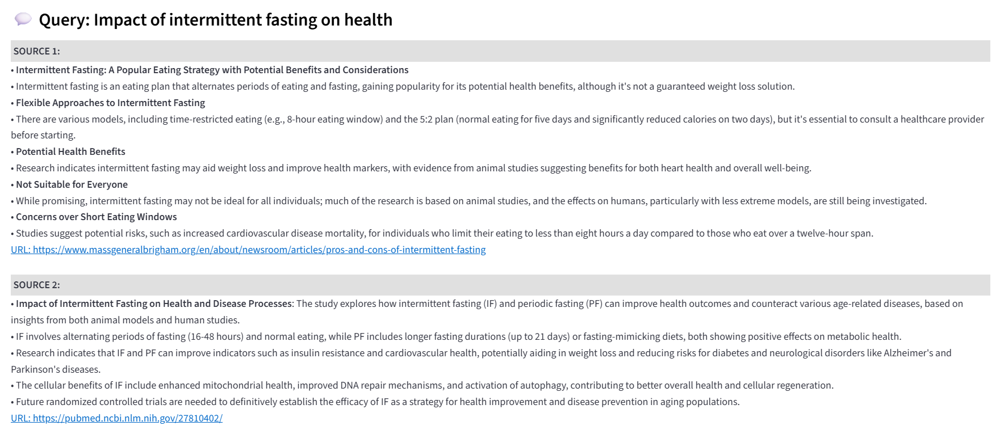

# 🤖 AI Research Agent

AI Research Agent is a lightweight agent that helps fetch, summarize, and structure research content from multiple sources online. Each generated report is saved into a database for easy revisiting, and you can view or download the reports as PDFs directly from the Streamlit web interface.

---

## 🚀 Features

- Accepts natural language queries (e.g., “Latest research on AI in education”).
- Fetches 2–3 relevant online sources per query using Tavily API.
- Extracts content from:
    - 🌐 Web pages (HTML) using trafilatura
    - 📄 PDFs using PyPDF2
- Summarizes each source into concise bullet points via OpenAI GPT.
- Saves every report in a SQLite database.
- View and download reports as PDFs.
- Browse your history of past reports.

---

## ⚙️ How it Works

### Workflow
1. **Input**: User enters a query (e.g., "Impact of Mediterranean diet on heart health").
2. **Agent**:
    - Web Search API (Tavily) fetches top sources.
    - Content Extractor reads text from HTML and PDFs.
    - OpenAI GPT summarizes content into structured bullet points.
3. **Storage**: Query + report saved in SQLite database. 
4. **UI**: Streamlit web app to view current + past reports and download PDFs.

---
## 🧩 Project Structure
   ```bash
    AI_Research_Agent/
    │── app.py               # Streamlit web app
    │── agent.py             # Research agent
    │── db.py                # SQLite database 
    │── utils.py             # PDF generation & formatting helpers
    │── requirements.txt     # Python dependencies
    │── README.md            # Project documentation
    │── .env                 # API keys
    └── samples/             # Folder for sample output files
```
---

###   Architecture Diagram

```text
┌─────────────┐     ┌──────────────┐     ┌──────────────┐     ┌──────────────┐     ┌──────────────┐
│   User      │ ──> │   Agent      │ ──> │ Content      │ ──> │   Database   │ ──> │ Streamlit UI │
│  Query      │     │ (LLM + tools)│     │ Extraction   │     │   (SQLite)   │     │              │
└─────────────┘     └──────────────┘     └──────────────┘     └──────────────┘     └──────────────┘
```
---

## ⚙️ Setup Instructions

1. **Clone the repo**
   ```bash
    git clone https://github.com/<your-username>/AI_Research_Agent.git
    cd AI_Research_Agent

2. **Create and activate virtual environment**
    ```bash
    python -m venv venv
   source venv/bin/activate   # Mac/Linux
   venv\Scripts\activate      # Windows

3. **Install dependencies**
   ```bash
   pip install -r requirements.txt
    
4. **Add Environment Variables**

   Create a .env file in project root:
   ```bash
   OPENAI_API_KEY=your_openai_key
   TAVILY_API_KEY=your_tavily_key

5. **Run App**

   ```bash
   streamlit run app.py

---

## 🎨 Streamlit Interface

After you successfully set up the app, your Streamlit interface should look like this:

1. Without any prior query entry/report generation:


2. After few query entries/report generations:
   


---

## 📝 Sample Queries & Reports 

Here’s few sample input queries and the generated streamlit report and PDF report:  

### Input Goal:

### 1. *"Latest research on AI in education"*

   Generated report (streamlit) :
   
   

  **Generated report(PDF) :**   [Download](./samples/sample_report_1.pdf) 

### 2. *"Trends in renewable energy adoption 2025"*
 
   Generated Output (streamlit) :
   
   

  **Generated Output (PDF) :**   [Download](./samples/sample_report_2.pdf)

### 3. *"Impact of intermittent fasting on health"*
 
   Generated Output (streamlit) :
   
   

  **Generated Output (PDF) :**   [Download](./samples/sample_report_3.pdf)

---

## 🧠 AI Assistance Disclosure

This project leveraged AI (ChatGPT) for guidance on designing prompts, organizing code structure, and improving readability. The full implementation, testing, final integration, and learning process were completed independently by me.


